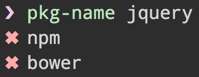

# Deprecated

Use [`npm-name`](https://github.com/sindresorhus/npm-name) instead.

---

# pkg-name [](https://travis-ci.org/sindresorhus/pkg-name)

> Check whether a package name is available on npm and bower


## Install

```
$ npm install --save pkg-name
```


## Usage

```js
var pkgName = require('pkg-name');

pkgName('chalk', function (err, available) {
	console.log(available);
	//=> {npm: false, bower: false}
});
```


## CLI



```
$ npm install --global pkg-name
```

```
$ pkg-name --help

  Usage
    $ pkg-name <name>

  Examples
    $ bower-name multiline
    ✖ Unavailable
    $ bower-name unicorn-cake
    ✔ Available
```


## License

MIT © [Sindre Sorhus](http://sindresorhus.com)
